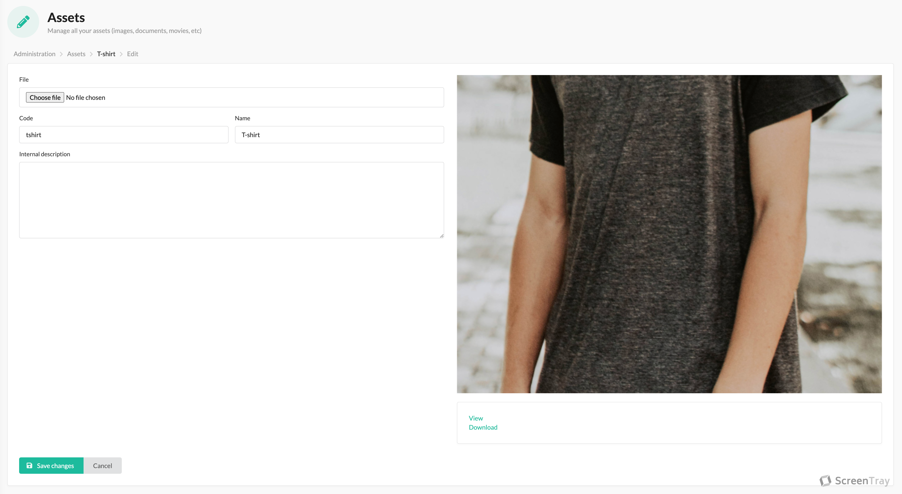

Assets is an umbrella term for all your images, videos, files etc. Most likely you will use assets for images most of
the time and to render an image asset you write `{{ sscms_asset('your asset code') }}` in your template.

Below you see an example of an existing asset.

## Technicalities

When developing the plugin we have chosen _not_ to utilize the `LiipImagineBundle` for image assets because of a few
reasons:

1. Out of the box, the imagine library will make the image quality poorer, and we trust that frontenders / marketing
people are used to creating pixel perfect high quality images, and we don't want to get in the way of that.
2. If we created a filter set, what settings would we choose? Would we choose a maximum of 2000 px wide images? And why?
Would we choose a quality of 100 or 80? Instead of trying to make a decision for you, we give you the bare asset.

Rendering an image asset will give you something like ``. This URL has
cache headers which means it will be cached by 1) browsers, but also by 2) reverse proxies like Cloudflare.
The implication of that is that it's unwise to change an asset once created because that asset might be cached.
