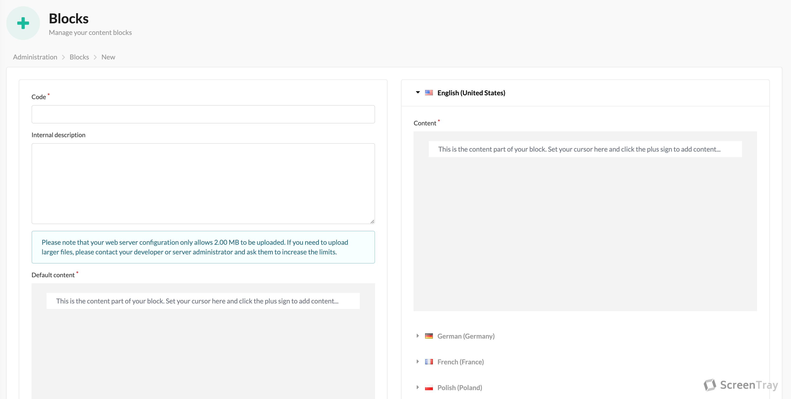

The name _blocks_ gives the concept away. These are the building blocks of anything else. This is what everything else
is made up of. If you don't add blocks, you will not have any content.

Though simple, we have added a few things to make it shine. The interface looks like this:

## Default content

As you can see we have added a default content field. Let's say you want to output **BLACK FRIDAY** in a block to all
your users, no matter their language. This is the field for that. This way you don't have to copy 'BLACK FRIDAY' in
all the content fields. It's also very useful when you add new languages. With the default content field these new
languages will have content to show instead of nothing.

## The editor

The editor we use is the [editorjs](https://editorjs.io/). It's what's called a block-based or block-styled editor much
like the Gutenberg in Wordpress. All paragraph, images, quotes etc. are made up of small pieces that are then turned
into JSON and subsequently turned into HTML. If you want a new feature in the editor please reach out or if it's very
specific to your business have your developer create a plugin for the editor (it's rather simple ;)).

## Content is rendered as Twig

Woohooo! If you read the [templates](templates.md) page you know the power of Twig. Instead of just outputting the
HTML generated, we generate Twig and when blocks are rendered, they are rendered in the Twig engine. This means you
can for example output/use global Twig variables directly in your blocks. I.e. `{{ sylius.channel.code }}` would output
the `code` value for the current channel.
