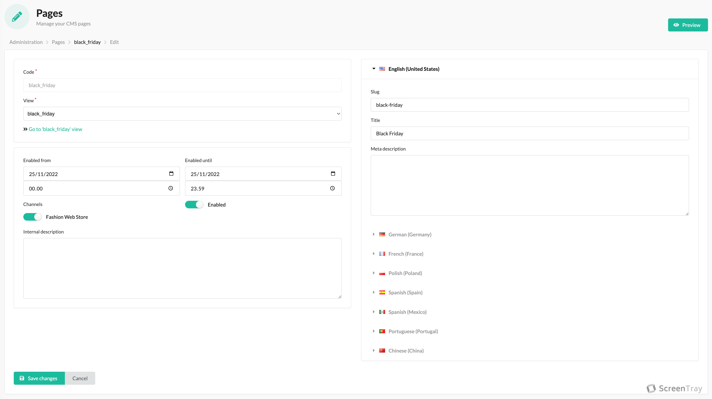

Pages is where you create your landing pages, content pages etc. for your store. Below is the interface for creating
a page, and we will go through the different features here.

1. Notice that the content of your page is determined by the associated view (see [views](views.md)). This has the (great)
side effect that if you have some content (an example could be terms and conditions) that you want in multiple places,
but also on a separate page, you create that content as a view, and then you can use that view for outputting directly
in templates, but also associating that view with a page (i.e. a URL).
2. Secondly you have eligibility. The example is for Black Friday, and we want the page to go live at `00:00` on Black
Friday and go offline again at `23:59`. Here you also find the toggling of `Enabled` and channels.
3. On the right you have the features that make this a page, i.e. the URL and title along with meta description for SEO
purposes.
4. In the right-hand corner you have the `Preview` button, which as the name suggest, will allow you to preview your page
despite it not being eligible to show to users yet.
