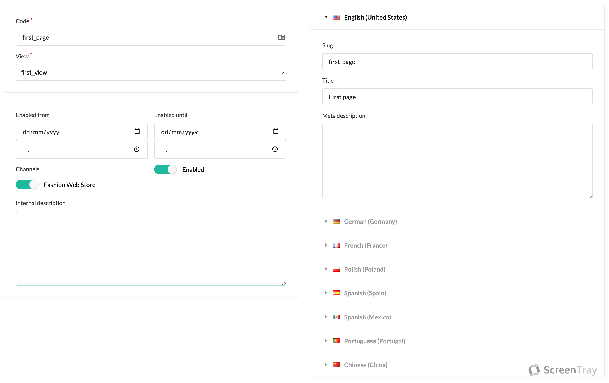

Creating your first page is a great start to getting to know the CMS capabilities. It will guide you through the process
of creating templates, views, and blocks.

When a page is requested, the CMS will go through this _flow_:

1. See if that page exists and is eligible to be shown
2. Then render the view associated with the page
3. The view in turn renders the blocks and the blocks are rendered in places determined by the template

## Creating your first template

From this short description, you can deduce that the basis for our page is the template, so let's create a template.
Click on `Templates` in the menu and click `Create`. Input `first_template` in the `Code` field and the following to the
`Source` field:

```twig


    Default content for this section

```

The internal description field is used for your internal usage to better identify templates later on.
Here is a screenshot of what you should have now:



The prefix `sscms_section_` is how you denote sections inside templates. Hence, we have just created a section inside
our template named `content`.


Last, but not least, hit `Create`.

## Creating your first block

Next up is creating the blocks we want to appear in the `content` section of the template. Go to `Blocks` and click `Create`.
Input `first_block` in the `Code` field and add your content to the content fields. You should end up with something like this:


Hit `Create`.

## Creating your first page

Last step! We will now create our page. Go to `Pages` and click `Create`. Input `first_page` in the `Code` field and
select the view we just created, namely `first_view`, and input `first-page` in the `Slug` field. Again, here is an
image showing what it could look like:



Click `Create`.

You're done! Go to `/en_US/first-page` to see your new page!
